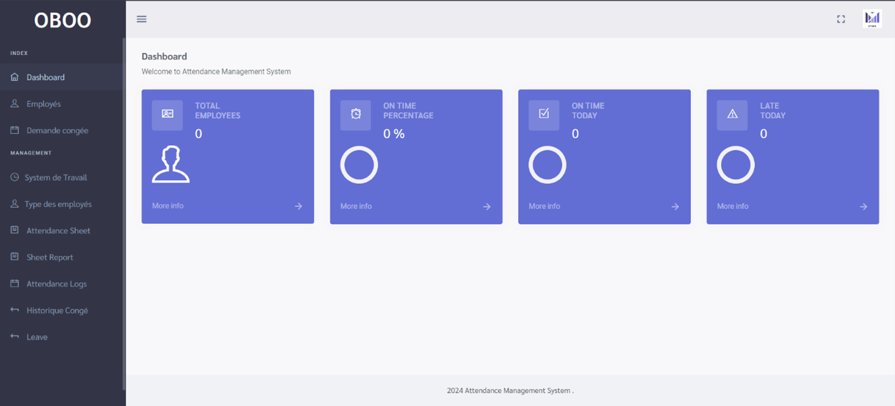
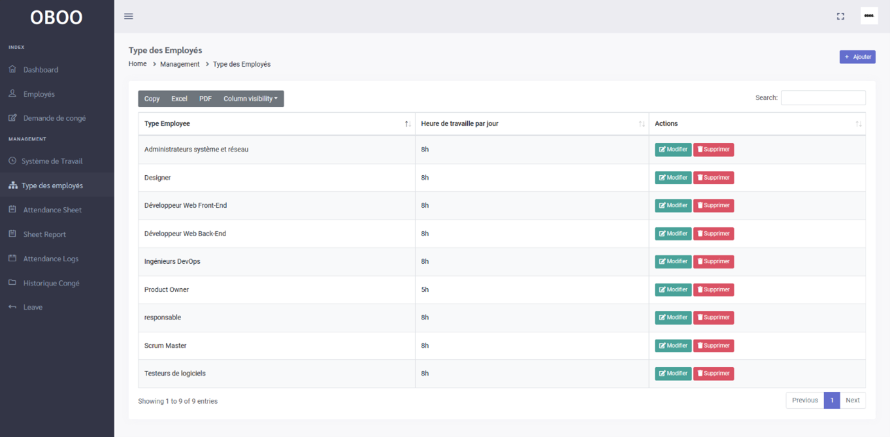
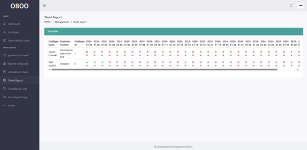
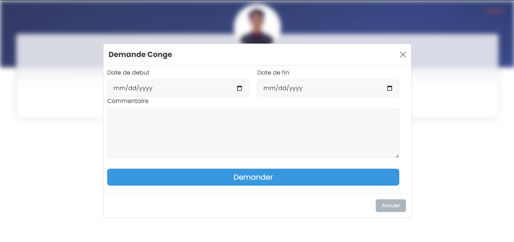

# Human Resources Management Application

## Project Overview

The objective of this project is to develop an application that helps businesses manage their human resources more efficiently. The project was implemented by a team of three students.

The application was developed using the following technologies:
- HTML5
- CSS3
- Bootstrap
- PHP
- Laravel
- MySQL

Designed to be user-friendly and customizable to meet the needs of different companies, the application is expected to provide numerous benefits, including:
- Improved efficiency in human resources management.
- Better-informed decision-making regarding human resources.
- Enhanced employee satisfaction.

## Application Features

### Administration

1. **Statistics**:
   - Display statistics such as the total number of employees, the number of employees on leave, etc.

2. **Employee Management**:
   - Implement CRUD operations to manage employee data.
   - Create and manage employee authentication.

3. **Work Hours Tracking**:
   - Display employees with their work hours.
   - Show validated hours and total salaries for each month.

4. **Employee Attendance**:
   - Visualize employee attendance.

5. **Attendance Download**:
   - Allow downloading of employee attendance records in Excel format.

6. **Leave Management**:
   - View the remaining leave days for each employee.
   - Display the list of employees on leave.
   - Manage leave requests by accepting or rejecting them.
   - Maintain a history of leaves.

7. **System Configuration**:
   - Configure employee types and their salaries according to the company's domain.
   - Set the system to deduct a specific amount for unjustified absences.

8. **Work System Configuration**:
   - Set up the work system, e.g., define a 5-day work week with 8 hours per day.

### Employee

1. **Leave Request**:
   - Allow employees to submit leave requests.

2. **Time Clocking**:
   - Enable employees to clock in their attendance at work.

### Employee Attendance

1. **Clocking Mechanism**:
   - Efficient clocking mechanism for accurate and quick employee attendance recording.
   - Detailed history of clock-ins, ensuring complete traceability.

### Leave Management

1. **Leave Request**:
   - Easy submission of leave requests through the application, simplifying the process.
   - Administrator validation or rejection of leave requests, ensuring proper control over planned absences.
   - Clear display of remaining leave balance for each employee, ensuring transparent human resource management.

### Absence Management

1. **Absence Declaration**:
   - Employees can declare their absences, justified or not, ensuring smooth communication within the company.

2. **Absence Tracking**:
   - Real-time tracking of employee absence periods, facilitating work schedule management and company activities.

3. **Absence Report Generation**:
   - Capability to generate detailed reports on absences for a given period, providing in-depth analysis for future decision-making.

### Screenshots from within the application

